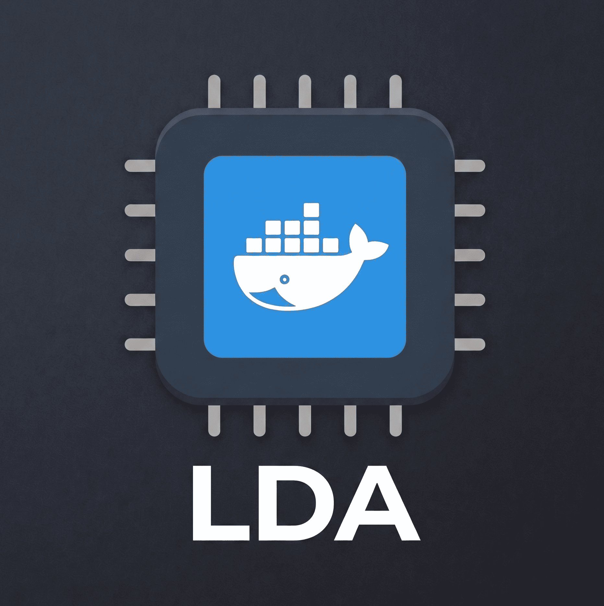

<p align="center">
  
</p>

<h1 align="center">LDA — Logical Docker Aliases</h1>

<p align="center">A curated set of short, memorable Docker aliases organized by category.</p>

Two-letter **prefix** picks the command. One-letter **suffix** is the first letter of the subcommand or flag.

```
dpl   → docker pull            dps   → docker ps
drn   → docker run             dpsa  → docker ps -a
drni  → docker run -it         drc   → docker rm

dlg   → docker logs            dim   → docker image
dlgf  → docker logs -f         dils  → docker image ls
                                dirm  → docker image rm
dv    → docker volume          dipr  → docker image prune
dvls  → docker volume ls
dvrm  → docker volume rm       dsy   → docker system
                                dsypr → docker system prune
```

```
dcp   → docker compose         dst   → docker start
dcpu  → docker compose up      dsp   → docker stop
dcpud → docker compose up -d   drs   → docker restart
dcpd  → docker compose down    dip   → docker inspect
dcpb  → docker compose build
dcpl  → docker compose logs
dcplf → docker compose logs -f
dcpr  → docker compose restart
```

Run `lda` to see every alias right in your terminal:

```
╔═════════════════════════════════════════════════╗
║                Docker Aliases                   ║
╠═════════════════════════════════════════════════╣
║ ── Pull / Run ──                                ║
║ dpl    │ docker pull                            ║
║ drn    │ docker run                             ║
║ drni   │ docker run -it                         ║
║ ── Container ──                                 ║
║ dps    │ docker ps                              ║
║ dpsa   │ docker ps -a                           ║
║         ...                                     ║
╚═════════════════════════════════════════════════╝
  37 aliases across 8 groups
```

## Install

```bash
curl -sL https://raw.githubusercontent.com/rockberpro/docker-lda/main/setup.sh | bash
```

Then reload your shell:

```bash
source ~/.bashrc
```

The setup script adds a single `source` line to `~/.bashrc` and copies two files to `~/`. You can read the full source ([setup.sh](setup.sh)) before running it, or use the manual install below.

**Manual install:**

```bash
curl -sL https://raw.githubusercontent.com/rockberpro/docker-lda/main/docker-lda.sh \
  -o ~/.docker-lda.sh

curl -sL https://raw.githubusercontent.com/rockberpro/docker-lda/main/docker-lda-help.sh \
  -o ~/.docker-lda-help.sh && chmod +x ~/.docker-lda-help.sh

echo 'source ~/.docker-lda.sh' >> ~/.bashrc
source ~/.bashrc
```

## Alias Reference

| Alias   | Command                    | Group       |
| ------- | -------------------------- | ----------- |
| `dpl`   | `docker pull`              | Pull / Run  |
| `drn`   | `docker run`               | Pull / Run  |
| `drni`  | `docker run -it`           | Pull / Run  |
| `dps`   | `docker ps`                | Container   |
| `dpsa`  | `docker ps -a`             | Container   |
| `drc`   | `docker rm`                | Container   |
| `dex`   | `docker exec`              | Container   |
| `dexi`  | `docker exec -it`          | Container   |
| `dlg`   | `docker logs`              | Logs        |
| `dlgf`  | `docker logs -f`           | Logs        |
| `dim`   | `docker image`             | Image       |
| `dils`  | `docker image ls`          | Image       |
| `dirm`  | `docker image rm`          | Image       |
| `dipr`  | `docker image prune`       | Image       |
| `dv`    | `docker volume`            | Volume      |
| `dvls`  | `docker volume ls`         | Volume      |
| `dvrm`  | `docker volume rm`         | Volume      |
| `dcp`   | `docker compose`           | Compose     |
| `dcpu`  | `docker compose up`        | Compose     |
| `dcpud` | `docker compose up -d`     | Compose     |
| `dcpd`  | `docker compose down`      | Compose     |
| `dcpb`  | `docker compose build`     | Compose     |
| `dcpl`  | `docker compose logs`      | Compose     |
| `dcplf` | `docker compose logs -f`   | Compose     |
| `dcpr`  | `docker compose restart`   | Compose     |
| `dst`   | `docker start`             | Management  |
| `dsp`   | `docker stop`              | Management  |
| `drs`   | `docker restart`           | Management  |
| `dip`   | `docker inspect`           | Management  |
| `dsy`   | `docker system`            | System      |
| `dsypr` | `docker system prune`      | System      |
| `lda`   | show alias table           | Help        |

## Uninstall

```bash
sed -i '/source ~\/.docker-lda.sh/d' ~/.bashrc
rm ~/.docker-lda.sh ~/.docker-lda-help.sh
```

---

[setup.sh](setup.sh) · [docker-lda.sh](docker-lda.sh) · [docker-lda-help.sh](docker-lda-help.sh)
